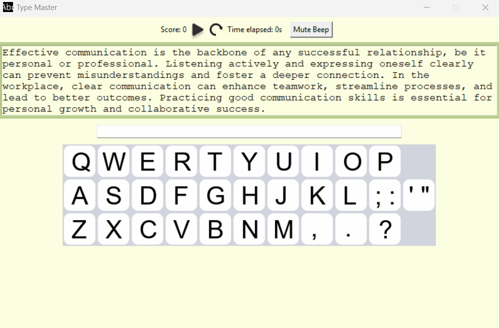

Here’s a polished and more professional version of your README that makes the project look cleaner, more engaging, and easier for contributors to understand:

---

# ⌨️ Typing Master Application

Typing Master is a Python application designed to help users improve typing speed and accuracy. Built with **Tkinter** for the graphical user interface (GUI), the app provides real-time feedback, accuracy tracking, and progress monitoring. Whether you're a beginner learning to type or an advanced typist aiming to sharpen your skills, this app offers a fun and interactive way to practice.

---

## 🎥 Demo


## 📘 Documentation
For detailed information about functions, classes, and return types, see:  
👉 [Functions Documentation](docs/functions.md)

## 🚀 Features
- **Interactive GUI** built with Tkinter  
- **Real-time feedback** on typing accuracy and speed  
- **Score tracking** with words-per-minute (WPM) calculation  
- **Pause/Resume functionality** with typing lock when paused  
- **Reset option** to restart exercises instantly  
- **Custom beep sounds** for correct/incorrect keystrokes, with mute/unmute toggle  
- **Keyboard visualization** that highlights pressed keys  

---

## 🛠️ Installation

Clone the repository:
```bash
git clone https://github.com/harris8099/Type-Master.git
```

Install dependencies (Tkinter is included with Python, but ensure `pygame` and `numpy` are installed):
```bash
pip install pygame numpy
```

Run the application:
```bash
python main.py
```

---

## 📸 Preview
`[Looks like the result wasn't safe to show. Let's switch things up and try something else!]`

---

## 🤝 Contributing
Contributions are welcome!  
If you’d like to help fix bugs, add new features, or improve the UI, please fork the repo and submit a pull request.

---

## 🐛 Known Issues
- Timer logic needs refinement for edge cases.  
- Some UI elements may overlap on smaller screens.  
- Sound generation can vary across operating systems.  

Help us identify and resolve these bugs to make Typing Master even better!

---

---

## 🛣️ Future Roadmap

We’re actively improving Typing Master and planning new features to make it more powerful and fun:

- **Difficulty Levels**: Easy, Medium, Hard — with progressively longer and more complex paragraphs.  
- **Typing History**: Save past sessions to track progress over time.  
- **Leaderboard**: Compare scores with friends or global users.  
- **Themes & Customization**: Dark mode, colorful themes, and customizable fonts.  
- **Statistics Dashboard**: Graphs for accuracy, WPM trends, and error analysis.  
- **Multilingual Support**: Practice typing in different languages.  
- **Challenge Mode**: Timed challenges and competitive typing tests.  
- **Achievements & Badges**: Unlock rewards for milestones like “1000 words typed” or “95% accuracy streak.”  

---
